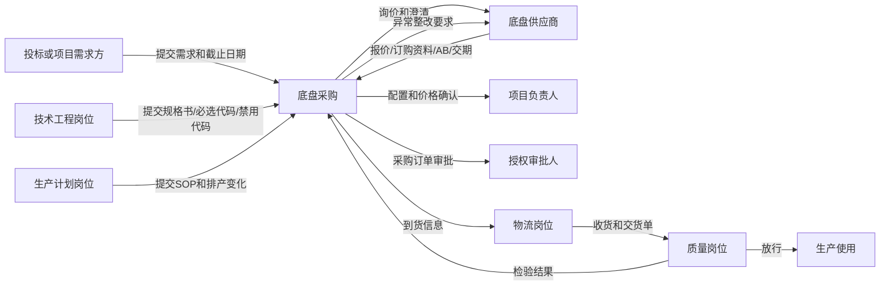

## 1. 全生命周期总流程

```mermaid
graph LR
    A["收到项目或投标需求"] --> B["确认项目基本信息"]
    B --> C["整理技术规格和商务条件"]
    C --> D["向供应商询价"]
    D --> E["审核报价"]
    E -- 存在偏差 --> F["要求修订报价"]
    F --> E
    E -- 审核通过 --> G["制作底盘预算与预核算"]
    G --> H{"项目是否中标"}
    H -- 否 --> I["归档并关闭项目"]
    H -- 是 --> J["接收最终底盘技术检查"]
    J --> K["向供应商索取正式订购资料"]
    K --> L["审核订购资料"]
    L -- 存在偏差 --> M["技术或商务澄清"]
    M --> L
    L -- 审核通过 --> N["创建SAP采购订单"]
    N --> O["内部复核与审批"]
    O --> P["发送正式订单"]
    P --> Q["催收并审核订单确认AB"]
    Q --> R["交期和配置变更管控"]
    R --> S["底盘到货和入库"]
    S --> T["质量检查"]
    T -- 不放行 --> U["异常整改与复检"]
    U --> T
    T -- 放行 --> V["注册文件和项目资料闭环"]
```

---

## 2. 采购角色协同流程

```mermaid
graph LR
    A["投标或项目需求方"] -- 提交需求和截止日期 --> B["底盘采购"]
    C["技术工程岗位"] -- 提交规格书/必选代码/禁用代码 --> B
    D["生产计划岗位"] -- 提交SOP和排产变化 --> B
    B -- 询价和澄清 --> E["底盘供应商"]
    E -- 报价/订购资料/AB/交期 --> B
    B -- 配置和价格确认 --> F["项目负责人"]
    B -- 采购订单审批 --> G["授权审批人"]
    B -- 到货信息 --> H["物流岗位"]
    H -- 收货和交货单 --> I["质量岗位"]
    I -- 检验结果 --> B
    B -- 异常整改要求 --> E
    I -- 放行 --> J["生产使用"]
```

---

[← 返回总目录](../README.md)
