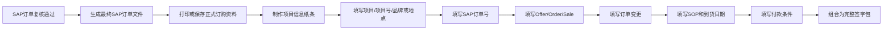
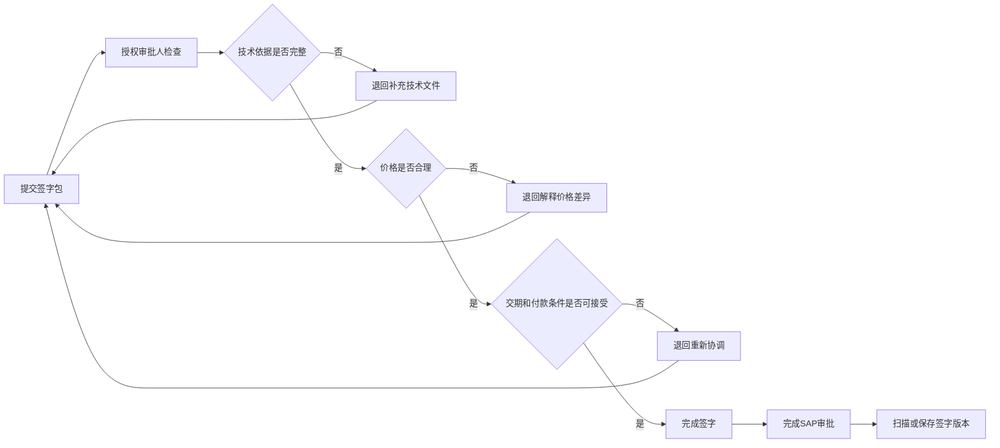

# 第四部分：审批与正式订单

> **流程目标**：确保对外订单在授权完成后准确发送，并形成法律与审计证据。  
> **主要责任角色**：采购与授权审批人。  
> **关键控制**：职责分离、签字完整、附件一致、发送对象准确。

## 22. 签字资料准备流程

```mermaid
graph LR
    A["SAP订单复核通过"] --> B["生成最终SAP订单文件"]
    B --> C["打印或保存正式订购资料"]
    C --> D["制作项目信息纸条"]
    D --> E["填写项目/项目号/品牌或地点"]
    E --> F["填写SAP订单号"]
    F --> G["填写Offer/Order/Sale"]
    G --> H["填写订单变更"]
    H --> I["填写SOP和到货日期"]
    I --> J["填写付款条件"]
    J --> K["组合为完整签字包"]
```

## 23. 审批流程

```mermaid
graph LR
    A["提交签字包"] --> B["授权审批人检查"]
    B --> C{"技术依据是否完整"}
    C -- 否 --> D["退回补充技术文件"]
    D --> A
    C -- 是 --> E{"价格是否合理"}
    E -- 否 --> F["退回解释价格差异"]
    F --> A
    E -- 是 --> G{"交期和付款条件是否可接受"}
    G -- 否 --> H["退回重新协调"]
    H --> A
    G -- 是 --> I["完成签字"]
    I --> J["完成SAP审批"]
    J --> K["扫描或保存签字版本"]
```

## 24. 正式订单发送流程

```mermaid
graph LR
    A["审批和签字完成"] --> B["新建供应商订单邮件"]
    B --> C["附加签字订购资料"]
    C --> D["附加SAP采购订单"]
    D --> E["写明车辆/项目/订单号"]
    E --> F["写明到货日期和交付地点"]
    F --> G["要求供应商安排生产"]
    G --> H["要求发送订单确认AB"]
    H --> I["指定订单确认公共邮箱"]
    I --> J["写入持续注册和GSR合规要求"]
    J --> K["核对附件和收件人"]
    K --> L["发送正式订单"]
    L --> M["保存外发邮件"]
    M --> N["上传SAP并关联项目"]
```

---

[← 返回总目录](../README.md)
