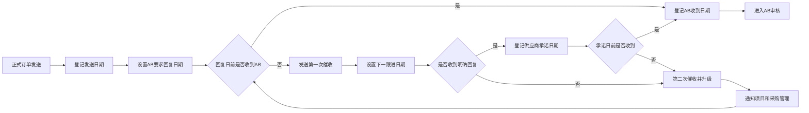
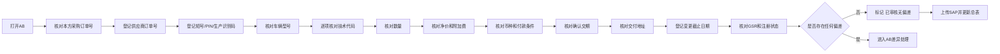
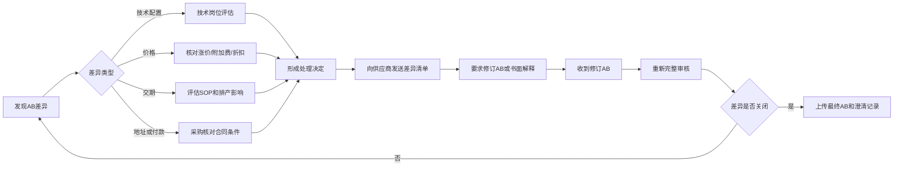

# 第五部分：订单确认AB

> **流程目标**：验证供应商接受的商业与技术条件与采购订单一致。  
> **主要责任角色**：底盘采购。  
> **关键控制**：配置、价格、数量、交期、地址、付款条件及变更截止日。

## 25. AB催收流程

```mermaid
graph LR
    A["正式订单发送"] --> B["登记发送日期"]
    B --> C["设置AB要求回复日期"]
    C --> D{"回复日前是否收到AB"}
    D -- 是 --> E["登记AB收到日期"]
    E --> F["进入AB审核"]
    D -- 否 --> G["发送第一次催收"]
    G --> H["设置下一跟进日期"]
    H --> I{"是否收到明确回复"}
    I -- 是 --> J["登记供应商承诺日期"]
    J --> K{"承诺日前是否收到"}
    K -- 是 --> E
    K -- 否 --> L["第二次催收并升级"]
    I -- 否 --> L
    L --> M["通知项目和采购管理"]
    M --> D
```

## 26. AB完整审核流程

```mermaid
graph LR
    A["打开AB"] --> B["核对本方采购订单号"]
    B --> C["登记供应商订单号"]
    C --> D["登记短号/PIN/生产识别码"]
    D --> E["核对车辆型号"]
    E --> F["逐项核对技术代码"]
    F --> G["核对数量"]
    G --> H["核对净价和附加费"]
    H --> I["核对币种和付款条件"]
    I --> J["核对确认交期"]
    J --> K["核对交付地址"]
    K --> L["登记变更截止日期"]
    L --> M["核对GSR和注册状态"]
    M --> N{"是否存在任何偏差"}
    N -- 否 --> O["标记 已审核无偏差"]
    O --> P["上传SAP并更新总表"]
    N -- 是 --> Q["进入AB差异处理"]
```

## 27. AB差异闭环流程

```mermaid
graph LR
    A["发现AB差异"] --> B{"差异类型"}
    B -- 技术配置 --> C["技术岗位评估"]
    B -- 价格 --> D["核对涨价/附加费/折扣"]
    B -- 交期 --> E["评估SOP和排产影响"]
    B -- 地址或付款 --> F["采购核对合同条件"]
    C --> G["形成处理决定"]
    D --> G
    E --> G
    F --> G
    G --> H["向供应商发送差异清单"]
    H --> I["要求修订AB或书面解释"]
    I --> J["收到修订AB"]
    J --> K["重新完整审核"]
    K --> L{"差异是否关闭"}
    L -- 否 --> A
    L -- 是 --> M["上传最终AB和澄清记录"]
```

---

[← 返回总目录](../README.md)
