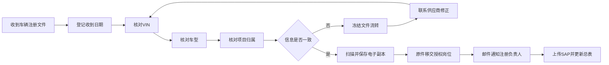
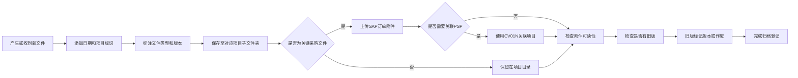
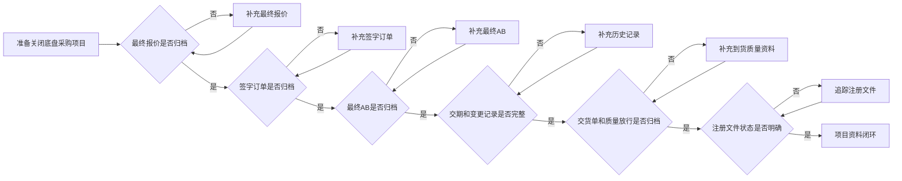

# 第八部分：注册文件与归档

> **流程目标**：建立完整、可检索、可审计的车辆和采购档案。  
> **主要责任角色**：采购及文件责任岗位。  
> **关键控制**：注册信息一致、版本受控、SAP与项目目录一致。

## 39. 注册文件处理流程

```mermaid
graph LR
    A["收到车辆注册文件"] --> B["登记收到日期"]
    B --> C["核对VIN"]
    C --> D["核对车型"]
    D --> E["核对项目归属"]
    E --> F{"信息是否一致"}
    F -- 否 --> G["冻结文件流转"]
    G --> H["联系供应商修正"]
    H --> C
    F -- 是 --> I["扫描并保存电子副本"]
    I --> J["原件移交授权岗位"]
    J --> K["邮件通知注册负责人"]
    K --> L["上传SAP并更新总表"]
```

## 40. 文件归档流程

```mermaid
graph LR
    A["产生或收到新文件"] --> B["添加日期和项目标识"]
    B --> C["标注文件类型和版本"]
    C --> D["保存至对应项目子文件夹"]
    D --> E{"是否为关键采购文件"}
    E -- 是 --> F["上传SAP订单附件"]
    E -- 否 --> G["保留在项目目录"]
    F --> H{"是否需要关联PSP"}
    H -- 是 --> I["使用CV01N关联项目"]
    H -- 否 --> J["检查附件可读性"]
    I --> J
    G --> J
    J --> K["检查是否有旧版"]
    K --> L["旧版标记版本或作废"]
    L --> M["完成归档登记"]
```

## 41. 项目结案完整性检查

```mermaid
graph LR
    A["准备关闭底盘采购项目"] --> B{"最终报价是否归档"}
    B -- 否 --> B1["补充最终报价"]
    B1 --> B
    B -- 是 --> C{"签字订单是否归档"}
    C -- 否 --> C1["补充签字订单"]
    C1 --> C
    C -- 是 --> D{"最终AB是否归档"}
    D -- 否 --> D1["补充最终AB"]
    D1 --> D
    D -- 是 --> E{"交期和变更记录是否完整"}
    E -- 否 --> E1["补充历史记录"]
    E1 --> E
    E -- 是 --> F{"交货单和质量放行是否归档"}
    F -- 否 --> F1["补充到货质量资料"]
    F1 --> F
    F -- 是 --> G{"注册文件状态是否明确"}
    G -- 否 --> G1["追踪注册文件"]
    G1 --> G
    G -- 是 --> H["项目资料闭环"]
```

---

[← 返回总目录](../README.md)
