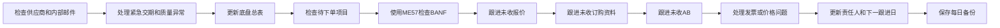
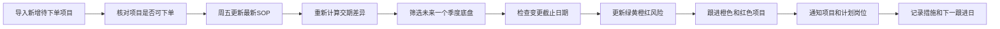
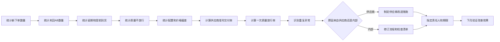

# 第九部分：周期性工作与管理

> **流程目标**：通过日、周、月管理节奏维持流程稳定和风险透明。  
> **主要责任角色**：底盘采购流程负责人。  
> **关键控制**：待办闭环、风险升级、KPI复盘和持续改进。

## 42. 每日工作流程

```mermaid
graph LR
    A["检查供应商和内部邮件"] --> B["处理紧急交期和质量异常"]
    B --> C["更新底盘总表"]
    C --> D["检查待下单项目"]
    D --> E["使用ME57检查BANF"]
    E --> F["跟进未收报价"]
    F --> G["跟进未收订购资料"]
    G --> H["跟进未收AB"]
    H --> I["处理发票或价格问题"]
    I --> J["更新责任人和下一跟进日"]
    J --> K["保存每日备份"]
```

## 43. 每周工作流程

```mermaid
graph LR
    A["导入新增待下单项目"] --> B["核对项目是否可下单"]
    B --> C["周五更新最新SOP"]
    C --> D["重新计算交期差异"]
    D --> E["筛选未来一个季度底盘"]
    E --> F["检查变更截止日期"]
    F --> G["更新绿黄橙红风险"]
    G --> H["跟进橙色和红色项目"]
    H --> I["通知项目和计划岗位"]
    I --> J["记录措施和下一跟进日"]
```

## 44. 每月管理复盘流程

```mermaid
graph LR
    A["统计新下单数量"] --> B["统计未回AB数量"]
    B --> C["统计延期和提前到货"]
    C --> D["统计质量不放行"]
    D --> E["统计配置和价格偏差"]
    E --> F["计算供应商准时交付率"]
    F --> G["计算一次质量放行率"]
    G --> H["识别重复异常"]
    H --> I{"原因来自供应商还是内部"}
    I -- 供应商 --> J["制定供应商改进措施"]
    I -- 内部 --> K["修订流程和检查清单"]
    J --> L["指定责任人和期限"]
    K --> L
    L --> M["下月验证改善效果"]
```

---

[← 返回总目录](../README.md)
